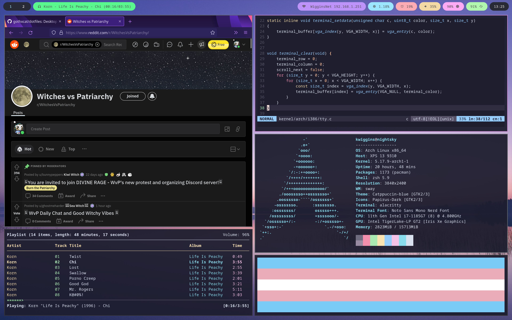

# Dotfiles

Desktop configuration for Linux

## Screenshots

## Details

- OS: [Arch Linux](https://archlinux.org/)
- Compositor: [Sway](https://swaywm.org/)
- Status bar: [Waybar](https://github.com/Alexays/Waybar/)
- Program launcher: [Wofi](https://hg.sr.ht/~scoopta/wofi)
- Shell: [zsh](https://zsh.sourceforge.io/)
- Shell configuration: [grml-zsh-config](https://github.com/grml/grml-etc-core)
- Terminal emulator: [Alacritty](https://github.com/alacritty/alacritty)
- Editor: [Neovim](https://neovim.io/)
- Themes: [Catppuccin](https://github.com/catppuccin/catppuccin), [Dracula](https://github.com/dracula/dracula-theme)
- Cursors: [Capitaine Cursors](https://github.com/keeferrourke/capitaine-cursors)
- Fonts: [Noto Sans](https://github.com/googlefonts/noto-fonts)
- Icons: [Papirus](https://github.com/PapirusDevelopmentTeam/papirus-icon-theme)
- Dotfiles manager: [Dotbot](https://github.com/anishathalye/dotbot)

## Prerequisites

- `sudo` and sudo permissions for the current user
- [pikaur](https://github.com/actionless/pikaur)

## Installation

Clone this repository to `~/.dotfiles` or your preferred location.

Run the shell commands as your user from the dotfiles directory, denoted by `$`:

`$ pikaur -Syu --noedit $(cat PACKAGES)`

`$ ./install`

Reboot and start Sway from the emptty display manager
- Run `nvim`
- Enter `:PlugInstall`
